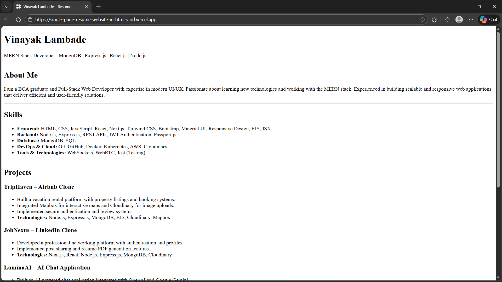
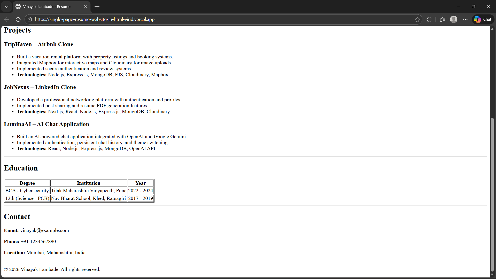

# Single-Page Resume Website

A clean, semantic HTML-based single-page resume website built without CSS styling. This project demonstrates proper HTML structure and semantic markup to create a professional resume layout.

## ✨ Features

The resume website includes the following sections:

- **Header/Name** - Personal name and title
- **About** - Brief introduction and professional summary
- **Skills List** - Technical and professional skills
- **Experience Table** - Work experience with company, role, and duration
- **Projects** - Notable projects and accomplishments
- **Education Table** - Academic qualifications and institutions
- **Contact Details** - Contact information and links

### Installation Steps

1. **Clone the repository**

   ```bash
   git clone https://github.com/VinayakLambade22/single-page-resume-website-in-HTML
   cd single-page-resume-website
   ```

2. **Open the HTML file**
   - Navigate to the project directory
   - Double-click `index.html` to open in your default browser
   - Or right-click → Open with → Choose your preferred browser

### Alternative Setup

Simply download the `index.html` file and open it in any web browser. No additional setup or dependencies required!

## 📂 Project Structure

```
single-page-resume-website/
│
├── index.html          # Main HTML file containing the resume
├── README.md           # Project documentation (this file)
└── screenshots/        # Screenshots of the final output (optional)
```

### HTML Elements Used

- Semantic HTML5 tags (`<header>`, `<section>`, `<article>`, `<footer>`)
- Headings (`<h1>`, `<h2>`, `<h3>`)
- Paragraphs (`<p>`)
- Lists (`<ul>`, `<ol>`, `<li>`)
- Tables (`<table>`, `<tr>`, `<td>`, `<th>`)
- Links (`<a>`)
- Line breaks (`<br>`)
- Horizontal rules (`<hr>`)

### Design Principles

- Clean and readable structure
- Proper HTML semantics
- Logical content hierarchy
- Well-organized sections
- Accessible markup

## 📸 Screenshots




## 🌐 Live Demo

## **Live Website:** [View Resume](https://single-page-resume-website-in-html-virid.vercel.app/)

## 📧 Contact

If you have any questions or would like to connect, please feel free to reach out.

<p align="left">
  <a href="https://linkedin.com/in/vinayaklambade" target="_blank">
    
  </a>
</p>

## 📄 License

## This project is open source and available for personal and educational use.

**Note:** This is a basic HTML-only resume. For enhanced styling and responsiveness, consider adding CSS in future iterations.
